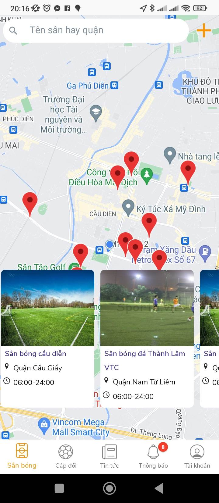

Currently, the most popular solution for finding football matches is posting on Facebook groups. The image below depicts a post in a popular football match group on Facebook. Like other Facebook posts, we see the poster (the team's representative), description, and often a photo of the team below. In the description, commonly found information related to the team such as time, whether there is a home ground or to find a field, which field, the level of the team (self-assessment, so it is difficult to control), player information. representation such as name, phone number. And below the comment section, the teams will leave comments and actively contact the team representative who posted.

As analyzed in Chapter 1, this method is manual and contains many risks. We can't control how powerful the team posts or how moral they are. And if we want to find a team with the right time and place, we have to do it manually too.

There have been a few applications that solve this problem, the most typical is Sporta. They have data on multiple pitches, which makes bookings easier, although bookings still need to be done manually (calling in). Their news section functions the same as the Facebook post described above.

Find the football field

Post

However, app downloads are low (5k). The actual number of users is also not high. Sometimes there is no team to post as shown below. Judging the strength of the team and assessing the ethics is done by hand, so it still has the same problem as posting on Facebook

Personal information and team information

The screen captures when there is an opponent

Screen catches for when there is no object

From the above analysis, our application will solve the shortcomings of the previous solutions and make a lean, easy-to-use application with the most secondary features for a team. The assessment of team strength will be based on their playing history and ethics will be assessed based on the number of points other teams leave them after each match. The user experience will be inspired by Tinder - the most popular dating app today.

Nope or Like

Main features like like, match, messaging, user profile