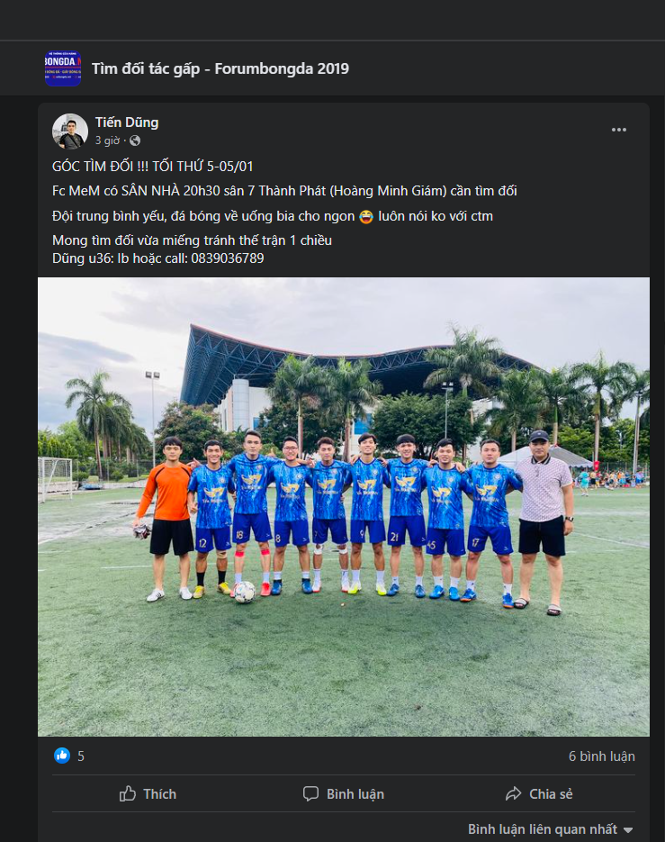
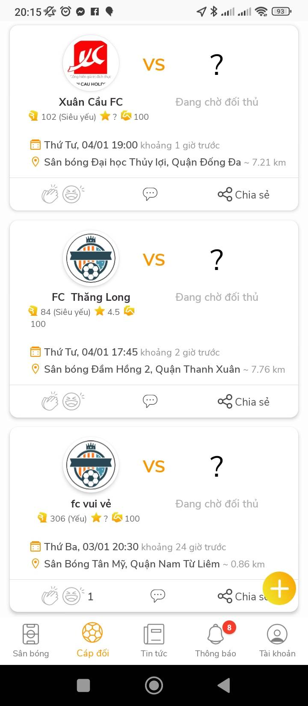
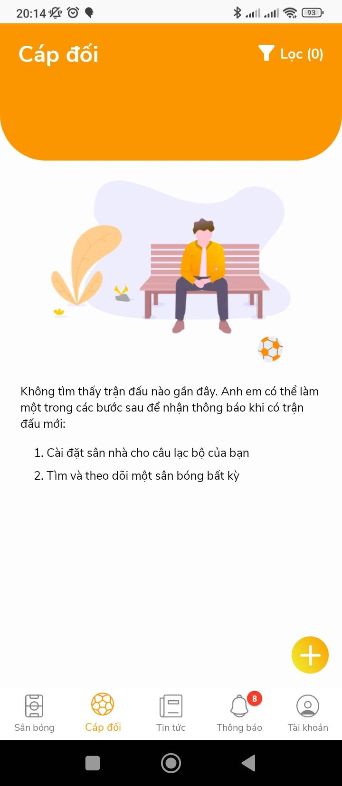
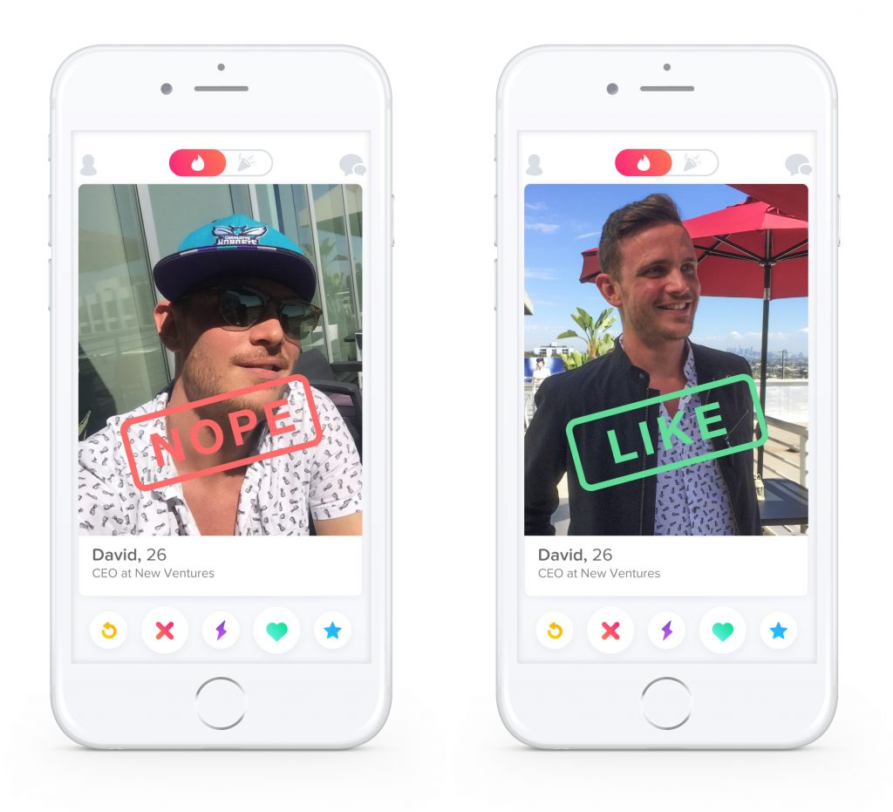

Chapter 2 of this report presents a requirement survey and analysis for the development of a new football match-finding application. In Chapter 1, we discussed the current methods used to find football matches and identified their limitations. In this chapter, we will conduct a survey to gather requirements for the new application, analyze the data, and use it to define the features and functionalities of the application. We will also explore the user experience design and technology aspects of the app.

Football has become a cultural phenomenon in Vietnam, with the nation's love for the sport dating back several decades. The game's rise to prominence in the country can be attributed to a combination of factors, including the influence of European colonizers, a desire for national unity and pride, and the emergence of local football heroes. Today, football is deeply ingrained in Vietnamese society, with millions of fans and players across the country. This thesis aims to explore the history of football in Vietnam, analyzing the key factors that led to its widespread popularity and examining the social and cultural impacts of the sport on Vietnamese society.

The prevailing approach for locating football matches currently is through posting on Facebook groups. A typical post in a renowned Facebook football group is displayed below. The post typically contains an image of the poster (team representative), a brief description, and sometimes a team photo. The description usually includes pertinent information such as time, the availability of a home ground or need to locate a field, field location, team proficiency (self-assessed, so it is challenging to control), and player details such as name and phone number. Beneath the comments section, teams commonly leave comments and reach out to the posting team representative proactively.

As highlighted in Chapter 1, the current method of finding football matches through Facebook groups is labor-intensive and risky. We have no control over the authenticity or proficiency of the posting team. Additionally, if we want to find a team that matches our preferred time and location, we have to undertake the process manually.

Several applications have emerged to address this issue, with Sporta being the most prominent. The application has information on various pitches, making booking processes more straightforward, albeit still requiring manual booking (via phone calls). Their news section functions in the same way as the Facebook posts described earlier.

Find the football field

Post

Despite the availability of such applications, they have not been widely adopted by the football community. For example, Sporta, a typical application for booking pitches, has low download numbers, currently around 5,000. Moreover, the number of active users is also not high. In addition, the problem of assessing the skill level and the ethical conduct of the teams still remains, as it is done manually, just as with posting on Facebook. There are also instances when there are no teams available for booking, making it difficult for users to find a match through the application.

Personal information and team information

The screen captures when there is an opponent

Screen catches for when there is no object

| Criteria                | Facebook Groups                           | Sporta Application                           |
|-------------------------|-------------------------------------------|----------------------------------------------|
| Authenticity of Teams   | Risky and hard to control                 | Still relies on manual assessment            |
| Proficiency of Teams    | Self-assessed and hard to verify          | Still relies on manual assessment            |
| Time and Location       | Manual process to find a suitable match   | Information on pitches available for booking |
| Booking Process         | Not available                             | Manual booking via phone calls               |
| Number of Active Users  | High engagement but difficult to quantify | Low download numbers and active users        |
| Availability of Matches | Depends on posts and comments from teams  | Not always available                         |

Table: Comparing the Current Approach to Finding Football Matches on Facebook Groups and Sporta Application

As seen from the table above, the prevailing approach for locating football matches in Vietnam is through Facebook groups, which is a labor-intensive and risky process. The authenticity and proficiency of the teams are hard to verify, and finding a match that matches preferred time and location requires a manual process. On the other hand, the Sporta application provides information on various pitches, making the booking process more straightforward. However, the number of active users is low, and the problem of assessing the skill level and ethical conduct of the teams still remains. Moreover, there are instances when there are no teams available for booking, making it difficult for users to find a match through the application.

Based on the analysis above, our application aims to address the limitations of previous solutions by providing a streamlined and user-friendly experience with the essential features for a team. To evaluate the team's strength, we will use their playing history, and their ethics will be assessed based on the ratings given by other teams after each match. The user experience will draw inspiration from Tinder, the world's most popular dating app, to ensure a smooth and intuitive interface.

Nope or Like

Main features like like, match, messaging, user profile

In conclusion, the current solutions for finding football matches, such as posting on Facebook groups and using existing applications, have their limitations. They rely on manual processes, are time-consuming, and may not provide reliable information about the team's strength and ethics. Our new application aims to solve these shortcomings by providing a lean, easy-to-use app with features that meet the most critical requirements for a team. The assessment of team strength and ethics will be based on objective data from the team's playing history and the number of points other teams leave after each match. Inspired by Tinder's user experience, our app will provide a streamlined and intuitive interface for users to find and book matches quickly and easily.
