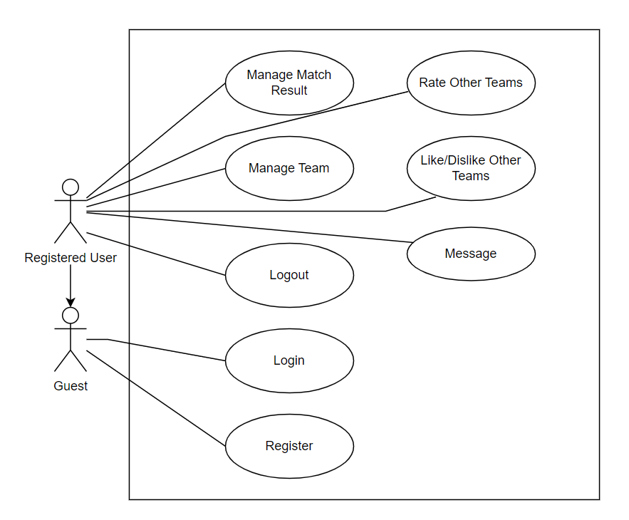
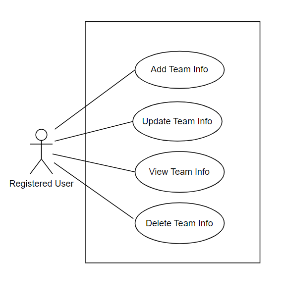
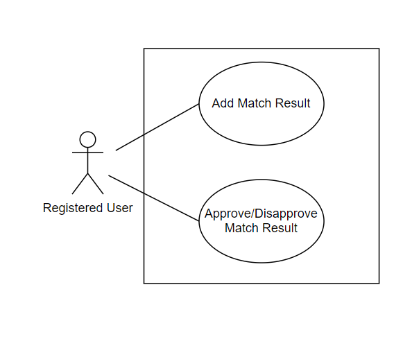

# 2.2.1. Overall Use Case Diagram

All the use cases of the system are collectively described by an overall use case diagram as shown in Figure 1.

In the system there are 2 agents, Guest and Registered User.

Overall Use Case Diagram

The guest is an actor who does not have an account or is not logged in. The user of the application will act as a guest for the first time when entering the application. Guests can register for a new account or log in to become an in-app user.

The registered user is an actor logged into the application. This agent can perform all the operations shown in the diagram.

# 2.2.2. Decomposition of Use Case Manage Team

Decomposition of Use Case “Manage Team”

The figure above “Manage a Team” use case breakdown depicts all the functions that registered users can use it to manage their team. Users can add team information, view and update existing information, or delete team information.

# 2.2.3. Decomposition of Use Case Manage Match Result

Decomposition of Use Case “Manage Match Result”

The figure above “Match Results Management” use case breakdown depicts all the functions that registered users can use it to manage their match results. Users can create a new match result, view and approve or disapprove existing results.