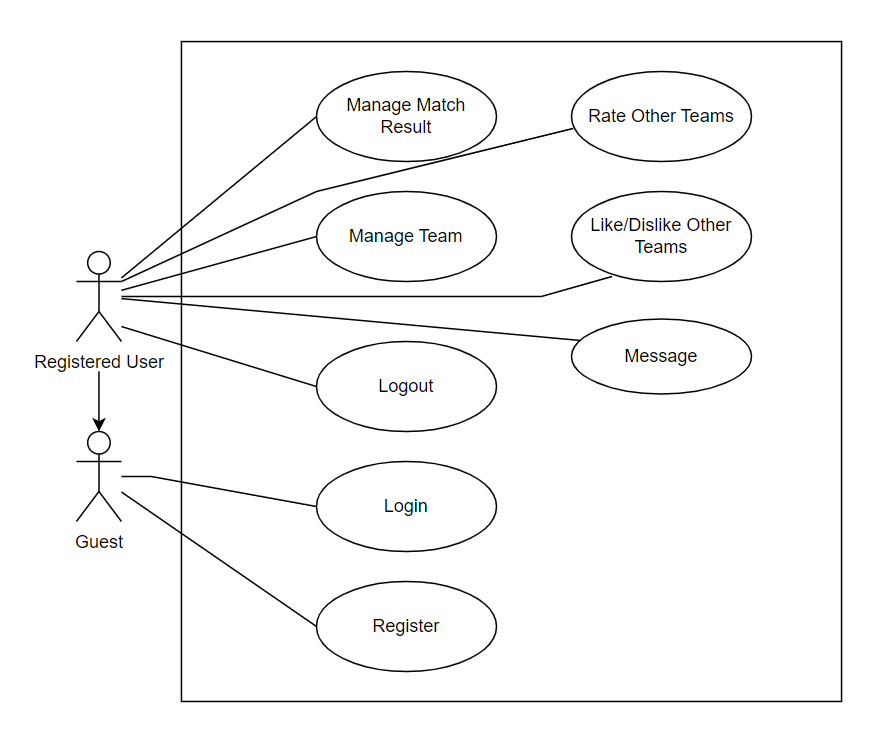
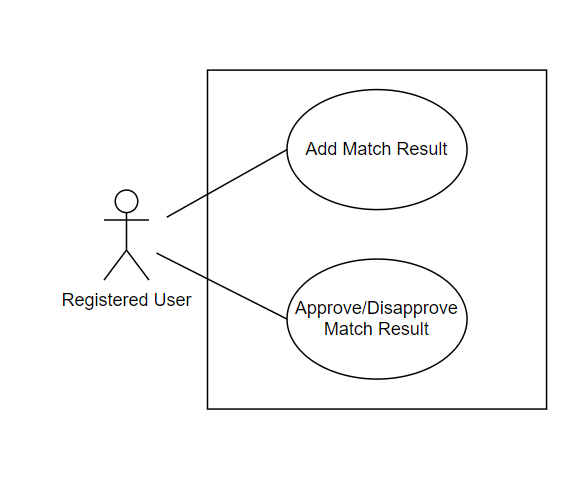

In this section, we will provide a functional overview of the software, highlighting the main features and capabilities that it will offer. This overview will provide a high-level understanding of the functionality of the software without going into the details of each function. The purpose of this section is to give an idea of what the software is capable of and to provide a foundation for the detailed specifications that will be presented in the following section. By the end of this section, readers should have a clear understanding of the main functions of the software, and be able to visualize how it will work in practice.

# 2.2.1. Overall Use Case Diagram

The system's overall use cases are represented by a use case diagram, shown in Figure 1.

The system has two types of actors: the Guest and the Registered User.

Overall Use Case Diagram

The guest is an actor who does not have an account or is not logged in. The user of the application will act as a guest for the first time when entering the application. Guests can register for a new account or log in to become an in-app user.

The registered user is an actor logged into the application. This agent can perform all the operations shown in the diagram.

# 2.2.2. Decomposition of Use Case Manage Team

Decomposition of Use Case “Manage Team”

The figure above “Manage a Team” use case breakdown depicts all the functions that registered users can use it to manage their team. Users can add team information, view and update existing information, or delete team information.

# 2.2.3. Decomposition of Use Case Manage Match Result

Decomposition of Use Case “Manage Match Result”

The figure above “Match Results Management” use case breakdown depicts all the functions that registered users can use it to manage their match results. Users can create a new match result, view and approve or disapprove existing results.