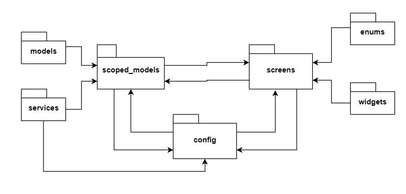
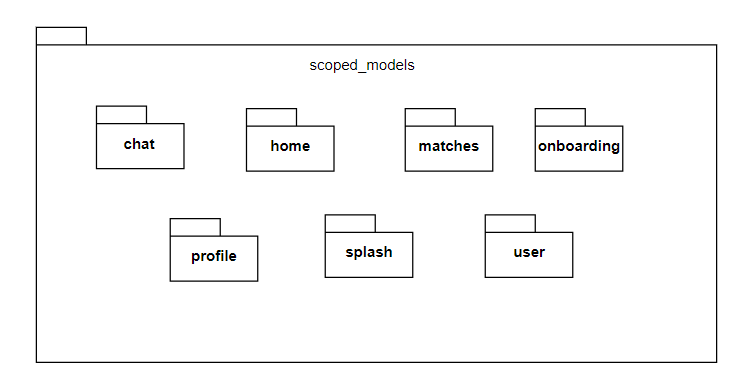
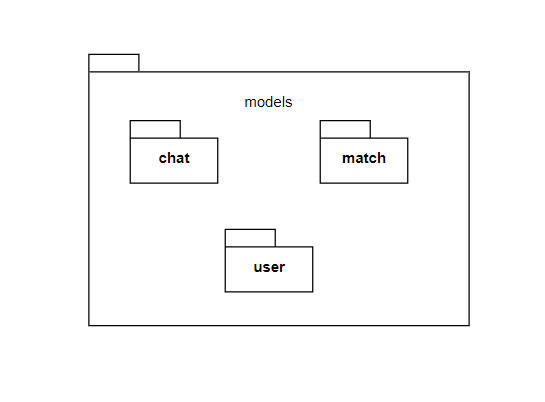

# 4.1.1. System Architecture Design

System architecture design would be the client-server architecture. The client-server architecture is a model in which the client and the server are separate components of the system. The client is responsible for handling the user interface and user interaction, while the server is responsible for managing the application's data and business logic. This architecture design allows for scalability and flexibility in the development process, as the client and server can be developed independently of each other.

Flutter framework would be used to develop the client-side of the application. Flutter allows for the development of high-performance user interfaces for both iOS and Android platforms. The Firebase platform would be used to develop the server-side of the application. Firebase provides a suite of services for backend development, including database, authentication, and storage.

To implement the client-server architecture, the client-side of the application would communicate with the server-side using RESTful APIs. The client-side would send requests to the server for data, and the server would respond with the requested data. The server would also receive data from the client for storage and processing.

The client-server architecture would allow for a clear separation of responsibilities in the application development process. The client-side development team would focus on designing and implementing the user interface, while the server-side development team would focus on designing and implementing the application's business logic and data storage. This would allow for more efficient development and testing, as each team can work independently of the other.

In addition, the client-server architecture would allow for scalability of the application. As the application grows and the number of users increases, the server-side can be scaled to handle the increased load. The client-side can also be updated and improved without affecting the server-side.

# 4.1.2. MVVM Architecture

MVVM is a widely used design pattern in mobile application development that separates the application logic from the UI layer, making the code more modular, maintainable and testable. This architecture has three main components:

- Model: This component represents the data layer and includes data models, repository classes and services. In your case, this would be where you integrate Firebase for data storage and retrieval.

- View: This component represents the UI layer and is responsible for displaying the data to the user. In your case, the View would be implemented using Flutter widgets.

- ViewModel: This component acts as a bridge between the View and the Model. It contains the business logic of the application, handles user actions, and communicates with the Model to retrieve and update data. The ViewModel also notifies the View of any changes in the data, so it can update the UI accordingly.

In MVVM, the View and ViewModel are loosely coupled, which means they can be developed independently. This allows for more flexibility and easier maintenance of the codebase. Additionally, the ViewModel can be easily tested using unit tests, which helps ensure the correctness of the business logic.

# 4.1.3. General design

In the design of front-end client applications, a well-organized package structure is essential to ensure that the code is scalable and maintainable. The Futebol application adopts a package structure that includes several key packages, such as "config", "enums", "models", "scoped_models", "services", "screens", and "widgets". The "config" package is responsible for navigating between screens, commonly used functions and constants, and everything related to the theme of the application. This package is essential in ensuring that the application is consistent in terms of its colors, font family, font size, and font weight for each type of text and icon. The "enums" package contains all the enumerations used in the application, which helps to ensure that the code is organized and can be easily understood.

The "models" package is responsible for parsing data from Firebase into a Dart object and parsing a Dart object into JSON to update Firebase. This package is crucial to ensure that the data is correctly parsed and stored, which is essential for the functionality of the application. The "scoped_models" package acts as the View-Model of the app, and it is responsible for managing the state and handling the business of the application. This package is crucial in ensuring that the code is scalable, maintainable, and easy to understand.

The "services" package is responsible for different services, such as API calls, database queries, and other services that the application may need. This package is essential in ensuring that the code is modular and can be easily maintained. The "screens" package contains everything that the user sees on their device, and it is composed of all screens in the application. This package is responsible for rendering the user interface and ensuring that the application is user-friendly and easy to use.

Lastly, the "widgets" package contains small components in the application that are often reused. This package is essential in ensuring that the code is modular and that the development process is streamlined. The Futebol application's package structure is an excellent example of how to organize code to ensure that it is scalable, maintainable, and easy to understand. It is an important aspect of the application's overall design and contributes to its success in the highly competitive mobile application market.

# 4.1.4. Detail package design

The structure of the "scoped_models" package is delineated in the Figure. The package encompasses several sub-packages, such as "chat", "home", "matches", "onboarding", "profile", "splash", and "user", each of which is attributed with its unique function. The sub-packages encapsulate the view-model for the corresponding screen, thereby facilitating the optimal separation of concerns. To illustrate, the "home" sub-package hosts the view-model that executes the necessary business logic for the home screen. Such a well-organized architecture endows the application with the requisite flexibility, maintainability, and scalability.

The organizational framework of the "screens" package is outlined in Figure. The package comprises of a set of sub-packages, including "chat", "home", "matches", "onboarding", "profile", "splash", and "user", each of which serves a unique purpose. The sub-packages contain the views for the corresponding screens, encompassing all the elements that are visible to the user on the screen, thereby promoting the separation of concerns. For instance, the "home" sub-package houses the structure and various small components of the view that are displayed on the home screen. This well-structured architecture enables the application to achieve a high degree of flexibility, maintainability, and scalability.

The structural composition of the "models" package is presented in Figure. This package encompasses a set of sub-packages, namely "chat", "match", and "user", with each sub-package serving a specific purpose. The data model is encapsulated within these sub-packages. As an example, the "user" sub-package comprises fields such as email, name, and image URLs, along with various functions aimed at parsing data and other pertinent tasks relevant to this class.