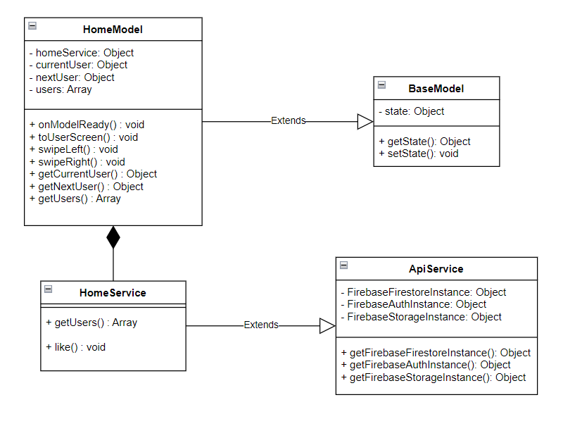
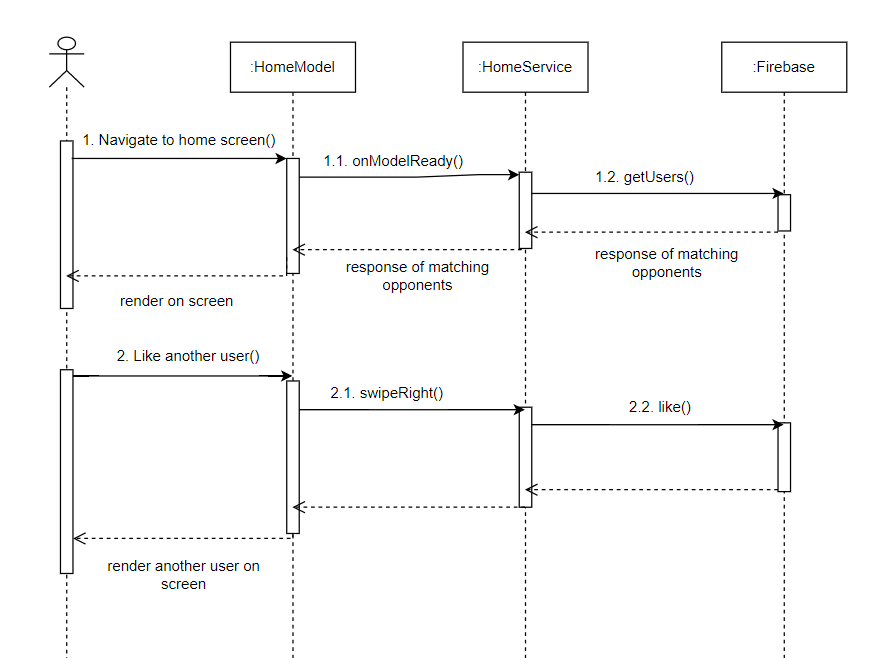

# 4.2.1. User interface

Futebol‘s user interface is designed as an mobile application. Detail information of the user's interface:
- Screen resolution: Appropriate for screen with resolution of 1360 px or higher
- Screen size: 6.7 inches or higher
- Element design: Make use of Google Material Design
- Font: Montserrat, Merriweather
- Display error: Display alert
- Language: English

Figure 25, Figure 26 and Figure 27 show some interfaces in applications:

# 4.2.2. Class design

This section will show the flow of work. And we will use the "Like a competitor" feature to show by showing the class diagram and sequence diagram for this use case.

Table 1 describes in detail the function of each method in the class HomeModel.

| Method           | Action                                                                                          |
|------------------|-------------------------------------------------------------------------------------------------|
| onModelReady()   | Equilavent to Flutter StatefulWidget initState(). Run first to load data needed for the screen. |
| toUserScreen()   | Navigate to user screen and show more information on the user                                   |
| swipeLeft()      | Dismiss this user. May suggest back to user at a later time                                     |
| swipeRight()     | Like this opponent. Add him to match screen                                                     |
| getCurrentUser() | Getter for corresponding attributes                                                             |
| getNextUser()    | Getter for corresponding attributes                                                             |
| getUsers()       | Getter for corresponding attributes                                                             |

Table 2 describes in detail the function of each method in the class HomeService.

| Method     | Action                                                 |
|------------|--------------------------------------------------------|
| like()     | Save the like to database when user like an opponent   |
| getUsers() | Return a list of the most promising opponents for user |

Sequence diagram of use case “Like other teams” is described as Figure 29

