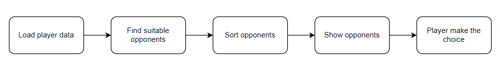

# 5.1.1. Problem description

In the pursuit of equitable competition, many individuals and teams seek opponents who are closely matched in skill level. A substantial discrepancy in skill level may lead to a unidirectional match, rendering the winning team dissatisfied by the lack of challenge and the losing team demoralized and disheartened. Consequently, the desire to bring together teams with similar levels of technical proficiency is motivated by the goal of promoting highly engaging and exhilarating matches that appeal to all involved parties.

# 5.1.2. Solution

In order to facilitate the identification of suitable opponents for users, the modified TrueSkill algorithm described in Chapter 3 will be utilized. The feature will be implemented in a step-by-step manner, comprising of the following stages: player data loading, identification of suitable opponents, sorting of potential opponents, presentation of the sorted list to players, and ultimately, the player's selection.



Initially, player strength score and position data is downloaded in step 1, following which other players located within a 20km radius of the player are identified based on their coordinates. In step 3, the difference in strength between the player and each of the identified opponents is calculated, and the players are then ranked from low to high based on the calculated differences. Subsequently, a list of the sorted opponents is saved and presented to the player, who then has the option to decide whether to proceed with the identified opponent.

The algorithm is presented as follows:

```
Input: Player data

Output: A list of suitable opponents

Algorithm:

    Iterate through the list of teams

    a. If the team is located within a 20km radius:
        Calculate the strength difference between the two teams
        Save the opponent data and strength difference in a list
    b. If the team is located outside the 20km radius, ignore

    Sort the saved list of potential opponents by their strength differences.
```